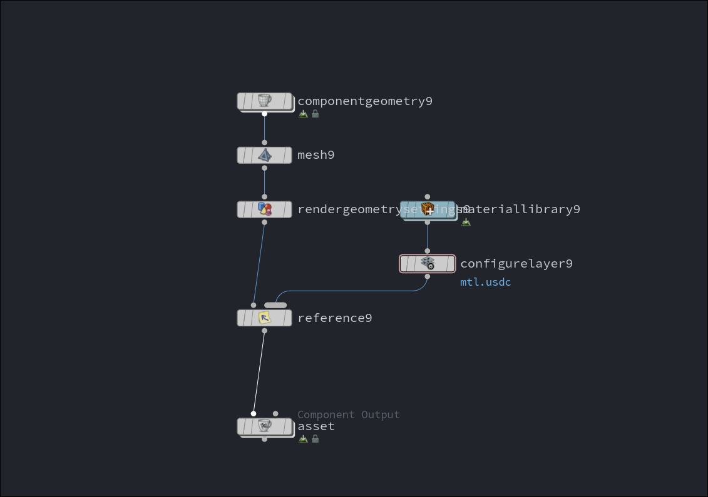

# Houdini Component Builder

Library for SideFX Houdini to build Solaris Component Builder networks.



## Installation

Use as a dependency in `pyproject.toml`:

```toml
[project]
dependencies = [
    "houdini-component-builder@git+https://github.com/beatreichenbach/houdini-component-builder",
]
```

## Supported Renderers

- [x] Arnold
- [x] Karma
- [ ] Redshift
- [ ] V-Ray
- [ ] RenderMan
- [ ] USD Preview

## Usage

Build a whole component:

```python
import hou
from component_builder import (
    Component,
    Geometry,
    Material,
    ArnoldComponentBuilder,
    ComponentType,
    TextureMap,
    ConvexHullProxy,
)

geometry = Geometry(path='/path/to/geo.abc', scale=0.01, proxy=ConvexHullProxy())

material = Material(
    name='base',
    values={ComponentType.SPECULAR_IOR: 1.4},
    textures={
        ComponentType.BASE_COLOR: TextureMap('base_color.jpg'),
        ComponentType.NORMAL: TextureMap('normal.jpg'),
        ComponentType.SPECULAR_ROUGHNESS: TextureMap('roughness.jpg'),
        ComponentType.DISPLACEMENT: TextureMap('displacement.exr'),
    },
    triplanar=True,
    triplanar_scale=2,
)

component = Component(
    name='table',
    geometry=geometry,
    material=material,
)

builder = ArnoldComponentBuilder()
builder.create_component(component, hou.node('/stage'))
```

## License

Copyright (c) 2026 Beat Reichenbach. This project is licensed under the [GPLv3 License](LICENSE).
